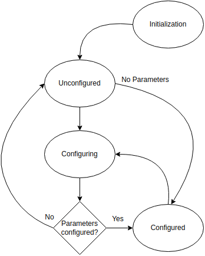

.. _vloop_startup:

=================
Startup procedure
=================

This section describes the steps that the software undertakes during a startup
of your voltage source control code (vloop).

Finite state machine
--------------------

The initialization workflow follows the steps of the finite state machine (FSM),
which is defined in the VSlib and is use-case independent, before the control
is handed over to user-defined code, which itself may contain a state machine.
The states and transition are as shown below:

.. _initialization_state:

1. Initialization

The first stage of the Vloop startup is the `Initialization` stage. During this stage,
the Vloop payload informs the `bmboot <https://bmboot.docs.cern.ch>`_ manager that it has successfully started,
and performs all the actions necessary to prepare the shared memory ranges, programmable
logic, and communication queues for the Vloop to perform its actions and communicate with
the Linux and regulation loop cores.

When the logic of this stage is executed, an object of the user-defined class containing
all :code:`Components` and :code:`Parameters` needed to control the hardware is created.
Then, the state transitions to `Unconfigured`.

.. _unconfigured_state:

2. Unconfigured

The transition from `Initialization` state is triggered after the user-defined class is initialized.
The entrance to the `Unconfigured` state triggers creation and upload of
the :ref:`parameter map <parameter_map>`.

In case there are no :code:`Parameters` to be configured, the state transitions directly to
:ref:`Configured <configured_state>` state. Otherwise, by default the state transitions
to :ref:`Configuring <configuring_state>`.

.. _configuring_state:

3. Configuring

In `Configuring` state, the methods to receive and process commands to set the :code:`Parameters`
are invoked. When done, the state automatically transitions away from `Configuring` to either
`Unconfigured`, if there are still :code:`Parameters` that have not been configured, or directly
to `Configured` if all :code:`Parameters` have been initialized and all validation checks passed
successfully.

.. _configured_state:

4. Configured

This is the final state of the VSlib FSM. If this is the first time the FSM enters the `Configured`
state, the :code:`init()` method of user-overriden :code:`IConverter` interface is called to perform
all the actions necessary for the user-class to start up, for example calling :code:`start()` methods
for all requested interrupts to begin real-time code execution.

Then, the code enters an infinite loop where first the code checks if there is a new configuration
waiting to be processed, and if yes: transitions to :ref:`Configuring <configuring_state>`, and if not
it calls the user-defined :code:`backgroundTask` method containing all the code to be executed in the background
on the user-side.
