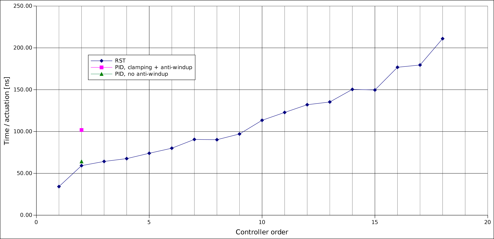

.. _controllers:

===========
Controllers
===========

This section contains the description of all controllers implemented in VSlib.

.. _controller_general_interface:

General interface
-----------------

All controllers described in further detail below, the :ref:`RST <rst_component>` and :ref:`PID <pid_component>`,
are both derived from and implement the :ref:`Component <component_api>` interface. They have a number settable
:ref:`Parameters <parameter_api>` that need to be defined before the component can be used.

The two distinct components serve only as an interface for your convenience, as they both use the same
engine, that of an :code:`RST` controller. Both components include a :ref:`LimitRange <limitRange_component>` component
to provide saturation protection and ensure that the actuation provided by the controller falls within the expected range.

Both components have a single access method to return the next :code:`double`-type actuation value called :code:`control`,
that takes two arguments of type :code:`double`: current measurement (process value) and current reference (set-point) values.
The :code:`control` method will return :code:`0.0` until the buffers with input histories for measurement and references are filled,
which is equal to the order of the controller, e.g. 2 iterations for a :code:`PID` controller. The algorithm to calculate the next
actuation is the following:

.. math::

    u_{k} = \frac{1}{S_{0}} \left[ \sum_{i=0}^{n_{T}} T_{i} r_{k-i} - \sum_{i=0}^{n_{R}} R_{i} y_{k-i} - \sum_{i=1}^{n_{S}} S_{i} u_{k-i} \right],

where: `u` are actuations, `r` are references, and `y` are measurements.

The input history buffers can also be filled manually by calling :code:`updateInputHistories` method, taking two :code:`double`-type
arguments with measurement and reference values respectively.

The anti-windup is triggered automatically when the resulting actuation value is outside the limits specified by the internal
:code:`LimitRange` component. It can be also triggered manually, by calling :code:`updateReference` method. The method takes one argument
of type :code:`double` with a new value of the actuation, which it uses to back-calculate what would have been the reference value,
given the known measurement, to result in that exact actuation value. The back-calculation uses the following formula, following
libreg's implementation:

.. math::

    r^{*}_{k} = \frac{1}{T_{0}} \left[ \sum_{i=0}^{n_{S}} S_{i} u^{*}_{k-i} +  \sum_{i=0}^{n_{R}} R_{i} y_{k-i} -  \sum_{i=1}^{n_{T}} T_{i} r^{*}_{k-i} \right].

Both components implement a :code:`reset` method that clear the cached histories of measurements, references, and actuations
to bring each component to its initial state.

.. _rst_component:

RST
---

The :code:`RST` component has a template parameter :code:`Order` that allows you to define the order of the controller. It has
three settable :code:`Parameters`: :code:`R`, :code:`S`, and :code:`T` polynomial coefficients, stored as
:code:`std::array<double, Order+1>`, and the aforementioned :code:`LimitRange`-type component called `actuation_limits`.
All :code:`Parameters` need to be defined before the controller can be used, even if the actuation limiter is not intended
to be used. In that case, it is recommended to set its :code:`min` and :code:`max` :code:`Parameters` outside of the operational
range of the controller, e.g. numerical limits of the :code:`double` type.

The provided input :code:`R`, :code:`S`, and :code:`T` coefficients, as well as :code:`min` and :code:`max` :code:`Parameters`
for the `actuation_limits` internal component are validated after any of the :code:`Parameters` is modified.
The validation includes checks internal to the `actuation_limits` :code:`Component` and specific to :code:`R`, :code:`S`, and :code:`T`.
Neither of the polynomial coefficient arrays' first element can be equal to 0.0. In addition, the :code:`S` and :code:`T` coefficients
are verified for stability using Jury's stability test:

1. Sum of odd-index coefficients must be larger than sum of even-index coefficients
2. Sum of coefficients divid must be larger than 0.0
3. Roots of the polynomial must lie within the unit circle.

In case any issue is found during validation, the offending :code:`Parameter` will not be accepted and cannot be used by
this controller. If everything is correct, the defined :code:`R`, :code:`S`, and :code:`T` values are used directly
by the `RST` controller engine.

For more details regarding the API, see the :ref:`API documentation for RST <rst_api>`.

Usage example
^^^^^^^^^^^^^

.. code-block:: cpp

    #include "rst.h"

    using namespace vslib;

    int main() {
        Component root("root", "root", nullptr);
        RST<2> rst("rst_1", &root); // 2nd order RST

        // set three-element array of R, S, and T to desired value
        // here, assuming:
        // r = {3.0015005, -5.999999, 2.9985005};
        // s = {1.001, -2, 0.999};
        // t = {4.0025005, -7.999999, 3.9975005};
        // actuation limit at numerical limits

        const double set_point_value   = 3.14159;
        const double measurement_value = 1.111;

        const double expected_actuation = ((t[0] + t[1] + t[2]) * set_point_value - (r[0] + r[1] + r[2]) * measurement_value) / s[0];

        auto actuation = rst.control(measurement_value, set_point_value); // 0.0
        auto ready = rst.isReady();                                       // false
        actuation = rst.control(measurement_value, set_point_value);      // 0.0
        ready = rst.isReady();                                            // false
        actuation = rst.control(measurement_value, set_point_value);      // expected_actuation's value
        ready = rst.isReady();                                            // true

        // reset between not-connected uses to clear cached data
        rst.reset();

        // update histories manually:
        ready = rst.isReady(); // false
        rst.updateInputHistories(measurement_value, set_point_value);
        ready = rst.isReady(); // false
        rst.updateInputHistories(measurement_value, set_point_value);
        ready = rst.isReady(); // true

        // trigger anti-windup calculation:
        const double limited_actuation = actuation - 1.0; // force clamping
        rst.updateReference(limited_actuation);

        return 0;
    }

.. _pid_component:

PID
---

:code:`PID` controller component implements the two-degrees of freedom controller functionality. This component
provides a `PID` interface, while internally, the control is calculated based on the 2nd order RST algorithm described in the
:ref:`general interface <controller_general_interface>` section.

This controller contains a previously mentioned :code:`LimitRange` component to clamp the actuation, as well as
a number of :code:`Parameters`, all of type :code:`double`:

1. kp - Proportional gain coefficient
2. ki - Integral gain coefficient
3. kd - Derivative gain coefficient
4. kff - Feed-forward scaling coefficient
5. b - Reference signal proportional gain scaling
6. c - Reference signal derivative gain scaling
7. N - Filter order for derivative input
8. T - Control period
9. f0 - pre-warping frequency

When any of the :code:`Parameters` changes value, it triggers validation workflow. In that workflow, the :code:`Parameters`
1-9 are recalculated to :code:`R`, :code:`S`, and :code:`T` polynomial coefficients according to the following formula,
in a general case when :math:`k_{p} \ne 0 \ne k_{d}`:

.. math::

    \begin{align}
    R_{0} &= \frac{1}{a^{2}}\left( k_{i} \cdot k_{p} \cdot N + k_{d} \cdot k_{i} \cdot a + k_{d} \cdot k_{p} \cdot a^{2} + k_{p}^{2} \cdot N \cdot a + k_{d} \cdot k_{p} \cdot N \cdot a^{2} \right) \\
    R_{1} &= \frac{2}{a^{2}}\left( k_{i} \cdot k_{p} \cdot N - k_{d} \cdot k_{p} \cdot a^{2} - k_{d} \cdot k_{p} \cdot N \cdot a^{2} \right) \\
    R_{2} &= \frac{1}{a^{2}}\left( k_{i} \cdot k_{p} \cdot N - k_{d} \cdot k_{i} \cdot a + k_{d} \cdot k_{p} \cdot a^{2} - k_{p}^{2} \cdot N \cdot a + k_{d} \cdot k_{p} \cdot N \cdot a^{2} \right) \\
    \\
    S_{0} &= \frac{1}{a^{2}} \left( k_{d} \cdot a^{2} + k_{p} \cdot N \cdot a \right) \\
    S_{1} &= -2.0 \cdot k_{d} \\
    S_{2} &=  \frac{1}{a^{2}} \left( k_{d} \cdot a^{2} - k_{p} \cdot N \cdot a \right) \\
    \\
    T_{0} &= \frac{1}{a^{2}} \left( k_{i} \cdot k_{p} \cdot N + k_{d} \cdot k_{i} \cdot a + k_{d} \cdot k_{ff} \cdot a^{2} + k_{d} \cdot k_{p} \cdot a^{2} \cdot b \ + \right. \\
          &\quad \quad \quad \left. k_{p}^{2} \cdot N \cdot a \cdot b + k_{ff} \cdot k_{p} \cdot N \cdot a + k_{d} \cdot k_{p} \cdot N \cdot a^{2} \cdot c \right) \\
    T_{1} &= \frac{2}{a^{2}} \left( k_{i} \cdot k_{p} \cdot N - k_{d} \cdot k_{ff} \cdot a^{2} - k_{d} \cdot k_{p} \cdot a^{2} \cdot b - k_{d} \cdot k_{p} \cdot N \cdot a^{2} \cdot c \right) \\
    T_{2} &= \frac{1}{a^{2}} \left( k_{i} \cdot k_{p} \cdot N - k_{d} \cdot k_{i} \cdot a + k_{d} \cdot k_{ff} \cdot a^{2} + k_{d} \cdot k_{p} \cdot a^{2} \cdot b - k_{p}^{2} \cdot N \cdot a \cdot b \  \right. \\
          &\quad \quad \quad \left. - k_{ff} \cdot k_{p} \cdot N \cdot a + k_{d} \cdot k_{p} \cdot N \cdot a^{2} \cdot c \right),
    \end{align}

where: :math:`a = \frac{2\pi f_{0}}{tan(\pi f_{0} T)}`. When the general case does not apply, and you have an integrator-only controller, the following set of equations is used instead:

.. math::

    R_{0} &= \frac{k_{i}}{a} \\
    R_{1} &= \frac{k_{i}}{a} \\
    R_{2} &= 0 \\
    \\
    S_{0} &= 1 \\
    S_{1} &= -2 \\
    S_{2} &= 0 \\
    \\
    T_{0} &= \frac{k_{i}}{a} + k_{ff} \\
    T_{1} &= \frac{k_{i}}{a} - k_{ff} \\
    T_{2} &= 0

Then, the :code:`R`, :code:`S`, and :code:`T` arrays of polynomial coefficients are set to the underlying :code:`RST` controller, and a validation
described in the :ref:`RST <rst_component>` section is performed.

For more details regarding the API, see the :ref:`API documentation for PID <pid_api>`.

Usage example
^^^^^^^^^^^^^

.. code-block:: cpp

    #include "pid.h"

    using namespace vslib;

    int main() {
        Component root("root", "root", nullptr);
        PID pid("pid", &root);

        // set three-element array of R, S, and T to desired value
        // here, assuming:
        // kp  = 0;
        // ki  = 0.0472;
        // kd  = 0;
        // kff = 6.1190;
        // b   = 0.03057;
        // c   = 0.8983;
        // N   = 17.79;
        // T   = 1.0e-3;
        // f0  = 1e-15;
        // actuation limit at numerical limits

        const double set_point_value   = 3.14159;
        const double measurement_value = 1.111;

        auto actuation = pid.control(measurement_value, set_point_value); // 0.0
        auto ready = pid.isReady();                                       // false
        actuation = pid.control(measurement_value, set_point_value);      // 0.0
        ready = pid.isReady();                                            // false
        actuation = pid.control(measurement_value, set_point_value);
        ready = pid.isReady();                                            // true

        // reset between not-connected uses to clear cached data
        pid.reset();

        // update histories manually:
        ready = pid.isReady(); // false
        pid.updateInputHistories(measurement_value, set_point_value);
        ready = pid.isReady(); // false
        pid.updateInputHistories(measurement_value, set_point_value);
        ready = pid.isReady(); // true

        // trigger anti-windup calculation:
        const double limited_actuation = actuation - 1.0; // force clamping
        pid.updateReference(limited_actuation);

        return 0;
    }

Performance
-----------

Performance of the controllers depend on their order and the frequency at which the internal automatic
anti-windup mechanism is engaged. The general numbers that can be expected for the two controllers are
presented in the table below and also as a figure.

.. list-table::
    :header-rows: 1

    * - Class
      - Order
      - Anti-windup
      - Access time [ns]
    * - PID
      - 2
      - None
      - 64
    * - PID
      - 2
      - Frequent
      - 102
    * - RST
      - 1
      - None
      - 34
    * - RST
      - 2
      - None
      - 59
    * - RST
      - 3
      - None
      - 64
    * - RST
      - 4
      - None
      - 68
    * - RST
      - 5
      - None
      - 74
    * - RST
      - 6
      - None
      - 80
    * - RST
      - 7
      - None
      - 91
    * - RST
      - 8
      - None
      - 90
    * - RST
      - 9
      - None
      - 113
    * - RST
      - 10
      - None
      - 123
    * - RST
      - 11
      - None
      - 132
    * - RST
      - 12
      - None
      - 135
    * - RST
      - 13
      - None
      - 150
    * - RST
      - 14
      - None
      - 177
    * - RST
      - 15
      - None
      - 180
    * - RST
      - 16
      - None
      - 211

