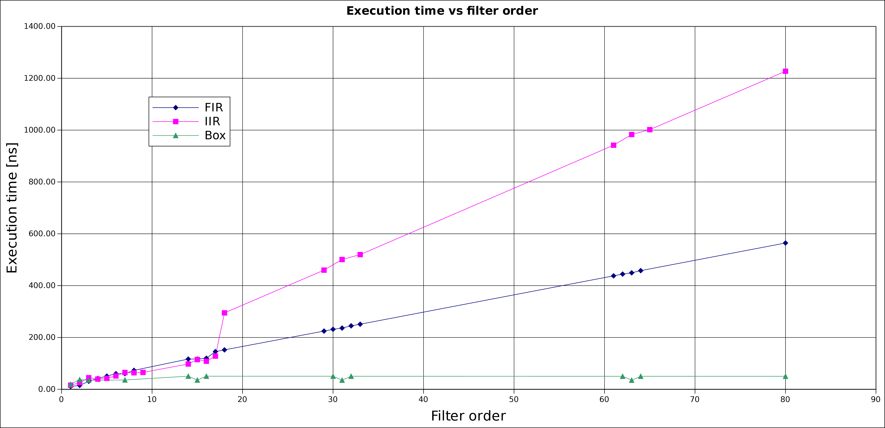

.. _filters:

=======
Filters
=======

Filters convolve the provided input data stream with either the defined array of coefficients
(finite-impulse, infinite-impulse) or the previous inputs (averaging filter). The VSlib provides three
types of filters: :code:`FIRFilter` implementing finite-impulse filter, :code:`IIRFilter` implementing infinite-impulse filter,
and :code:`BoxFilter` implementing averaging filter.

General interface
-----------------

All implemented filters derive from the :ref:`Filter <filter_api>` class and follow its interface. The
Filter base class ensures that each filter is a library :ref:`Component <component_api>` and implements all its features.
All Filters provide a consistent interface of a single main access method to be called to access its functionality:
:code:`filter`, which takes one :code:`double`` argument and returns :code:`double`-type filtered value, and a :code:`reset`
method to clear the input (and output for :ref:`IIRFilter <iir_component>`) history buffers.

.. _boxfilter_component:

Sliding-window averaging filter
-------------------------------

The :code:`BoxFilter` class implements the Sliding-window averaging filter. It has no settable Parameters. The inputs
are filtered with the general method :code:`filter`. They are continuously accumulated using fixed-point arithmetic to minimize
accumulation of floating-point errors. There are two template parameters that can be set: filter order to define the size
of the previous inputs history buffer size (order + 1), and maximal value that is expected to be filtered. The maximal value
template parameter has a default value of 100'000, and if the value you intend to filter with this component is not likely to be
larger than that, this parameter does not need to be specified.

For more details regarding the API, see the :ref:`API documentation for BoxFilter <boxfilter_api>`.

Usage example
^^^^^^^^^^^^^

.. code-block:: cpp

    #include <array>

    #include "boxFilter.h"

    using namespace vslib;

    int main() {
        Component root("root", "root", nullptr);
        BoxFilter<5> filter("swd", &root);

        std::array<double, 4> input = {1.0, 2.0, 3.0, 4.0};

        // filter inputs one-by-one
        auto output1 = filter.filter(input[0]);
        auto output2 = filter.filter(input[1]);
        auto output3 = filter.filter(input[2]);
        auto output4 = filter.filter(input[3]);

        // reset filter between not-connected uses to clear history
        filter.reset();

        return 0;
    }

.. _fir_component:

Finite-impulse filter
---------------------

The finite-impulse filter (FIR) convolves the provided input data stream with the defined array of coefficients,
saving history of previous inputs up to the length of the coefficient array. This component requires the order
of the filter to be defined at the initialization as a template parameter (see example below).

The :code:`FIRFilter` has one settable Parameter : array of coefficients (:code:`std::array<double>`) called
:code:`coefficients`. In addition to the main access method, :code:`filter`, the FIR filter provides also
a method for filtering an entire array in one go, also called :code:`filter` but one requiring a template
parameter: length of the input array to be filtered, to be provided.

For more details regarding the API, see the :ref:`API documentation for FIRFilter <fir_api>`.

Usage example
^^^^^^^^^^^^^

.. code-block:: cpp

    #include <array>

    #include "firFilter.h"

    using namespace vslib;

    int main() {
        Component root("root", "root", nullptr);
        FIRFilter<5> filter("fir", &root);

        // set filter coefficient array to the desired value

        std::array<double, 4> input = {1.0, 2.0, 3.0, 4.0};

        // filter inputs one-by-one
        auto output1 = filter.filter(input[0]);
        auto output2 = filter.filter(input[1]);
        auto output3 = filter.filter(input[2]);
        auto output4 = filter.filter(input[3]);

        // reset filter between not-connected uses
        filter.reset();

        // filter entire array data in one go
        auto output = filter<4>.filter(input);

        return 0;
    }

.. _iir_component:

Infinite-impulse filter
-----------------------

The ifinite-impulse filter (IIR) convolves the provided input data stream with the defined array of coefficients,
called :code:`numerator_coefficients` and the history of previous outputs with the defubed array of :code:`denominator_coefficients`,
saving history of previous inputs and outputs up to the length of the coefficient arrays (order + 1). This component requires the order
of the filter to be defined at the initialization as a template parameter (see example below).

The :code:`IIRFilter` has two settable Parameters: numerator and denominator coefficients (both of type :code:`std::array<double>`),
called :code:`numerator_coefficients` and :code:`denominator_coefficients`, respectively. In addition to the main access method,
:code:`filter`, the IIR filter provides also a method for filtering an entire array in one go, also called :code:`filter` but one requiring a template
parameter: length of the input array to be filtered, to be provided.

For more details regarding the API, see the :ref:`API documentation for IIRFilter <iir_api>`.

Usage example
^^^^^^^^^^^^^

.. code-block:: cpp

    #include <array>

    #include "iirFilter.h"

    using namespace vslib;

    int main() {
        Component root("root", "root", nullptr);
        IIRFilter<3> filter("iir", &root);

        // set two filter numerator and denominator coefficient arrays to desired values

        std::array<double, 4> input = {1.0, 2.0, 3.0, 4.0};

        // filter inputs one-by-one
        auto output1 = filter.filter(input[0]);
        auto output2 = filter.filter(input[1]);
        auto output3 = filter.filter(input[2]);
        // the first input and output are now forgotten
        auto output4 = filter.filter(input[3]);

        // reset filter between not-connected uses
        filter.reset();

        // filter entire array data in one go
        auto output = filter<4>.filter(input);

        return 0;
    }

Performance
-----------

