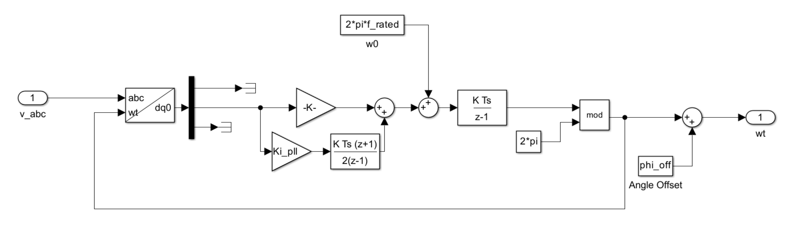

.. _phase_locked_loop:

==================
Phased-locked loop
==================

This chapter describes the Phase-locked loop (PLL) Component implemented in VSlib. Currently,
the only implemented PLL algorithm is a Rotating Reference Frame (SRF) PLL.

General interface
-----------------

The `PLL` Component is a composite Component, owning a :ref:`AbcToDq0Transform <abcToDq0Transform_component>`
and a :ref:`PID <pid_component>`. Therefore, all Parameters of these children Components must be set before
the `PLL` is ready to be used.

The `PLL` Component implements a single interaction method, called `balance`. It takes three
double-precision arguments: `a`, `b`, and `c` for each component of the three-phase current or voltage.
The output is a single value: :math:`\omega t`, being the output of the single iteration of locking
the phase. The output is guaranteed to fit in :math:`[0, 2\pi]` range, if the angle offset is set to 0.

The algorithm implemented in VSlib is equivalent to the following Simulink implementation:

For more details regarding the API, see the :ref:`API documentation for SRF PLL <sfr_pll_api>`.

Usage example
^^^^^^^^^^^^^

.. code-block:: cpp

    #include <numbers>

    #include "rootComponent.h"
    #include "srfPll.h"

    using namespace vslib;

    int main() {
        RootComponent root;
        SRFPLL pll("pll", root);
        // PI parameters need setting, here we assume the following are set:
        // kp  = 50;
        // ki  = 200;
        // kd  = 0.0;
        // kff = 0.0;
        // b   = 1.0;
        // c   = 1.0;
        // N   = 1.0; // should be 1 when kd = 0
        // T   = 1.0e-4;
        // f0  = 1e-12;
        // actuation limit at numerical limits

        const double v_a    = 1.0;
        const double v_b    = -0.5;
        const double v_c    = -0.5;

        const double wt_pll = converter.pll.balance(v_a, v_b, v_c);

        return 0;
    }

Performance
-----------

The execution time of the `SRFPLL` Component averages to 365 ns per call.
This is about 40 ns more than an `AbcToDq0Transform` and a `PID` controller, spent on calculating the next step
of the forward Euler algorithm and a floating-point modulo operation.